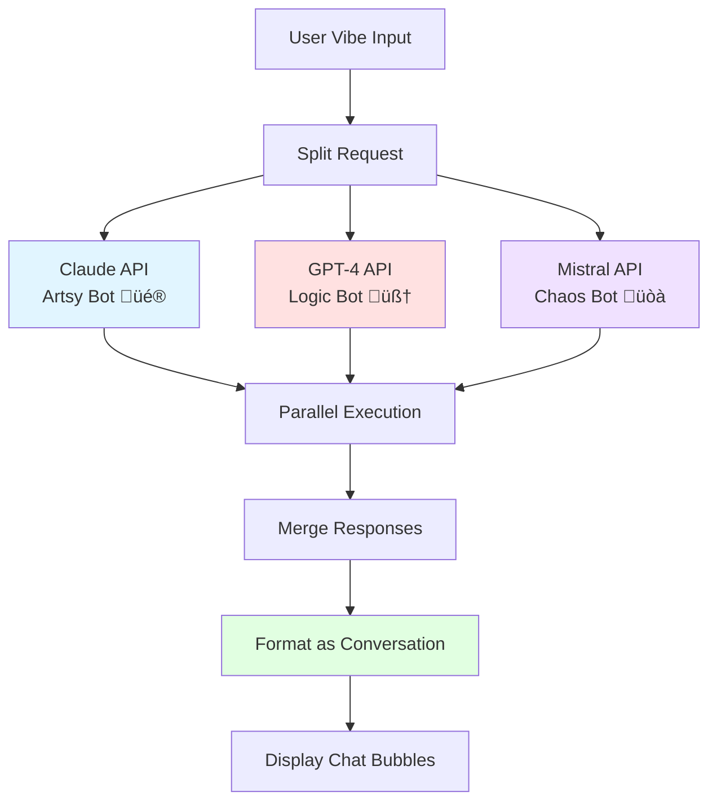

# Vibe to Cart - Architecture Documentation

## 🏗️ System Overview

**Vibe to Cart** is a full-stack web application that transforms user "vibes" into AI-generated product recommendations using OpenRouter's multi-model capabilities and LangChain for intelligent orchestration.

### High-Level Architecture


---

## 📦 Technology Stack

### Frontend

| Technology      | Version   | Purpose                        |
| --------------- | --------- | ------------------------------ |
| **React**       | 19.2.0    | UI framework                   |
| **TypeScript**  | Latest    | Type safety                    |
| **Vite**        | Latest    | Build tool & dev server        |
| **TailwindCSS** | (Planned) | Styling & rapid UI development |

### Backend

| Technology  | Version | Purpose                         |
| ----------- | ------- | ------------------------------- |
| **Node.js** | Latest  | Runtime environment             |
| **Express** | 5.1.0   | HTTP server & routing           |
| **dotenv**  | 16.4.5  | Environment variable management |

### AI & Orchestration

| Technology           | Version | Purpose                       |
| -------------------- | ------- | ----------------------------- |
| **LangChain Core**   | 1.0.4   | Message handling & primitives |
| **LangGraph**        | 1.0.2   | Agent workflow orchestration  |
| **LangChain OpenAI** | 1.1.0   | OpenRouter/OpenAI integration |
| **LangChain Tavily** | 1.0.0   | Web search capabilities       |
| **OpenRouter API**   | -       | Multi-model LLM access        |
| **Tavily API**       | -       | Web search service            |

---

## 🔄 Request Flow

### 1. User Interaction Flow


**Detailed Steps:**

1. **User enters vibe** (e.g., "I'm in my villain era")
2. **Frontend sends GET request** to `/agent?query=<vibe>`
3. **Express server validates** query parameter
4. **Server calls** `webSearchAgent({ description })`
5. **Agent orchestrates** AI + search tools
6. **Response returns** as plain text or JSON
7. **Frontend displays** product recommendations

### 2. API Endpoint Architecture

#### `GET /agent`

**Purpose:** Process user vibe and return AI-generated recommendations

**Request Format:**

```http
GET /agent?query=your-vibe-here HTTP/1.1
```

**Response Format:**

```
Plain text response with AI-generated product recommendations
```

**Error Handling:**

- 400: Missing or empty query parameter
- 500: AI processing error (with detailed error info)

**Code Location:** `src/api/server.js`

---

## 🤖 AI Agent Architecture

### Agent Components

The `webSearchAgent` (located in `src/api/services/aiAgent.js`) is built using **LangGraph's ReAct Agent** pattern:


### Agent Configuration

**File:** `src/api/agent.js`

**Key Components:**

1. **LLM (Language Model)**

   ```javascript
   new ChatOpenAI({
     model: "openai/gpt-4o-mini",
     temperature: 0,
     apiKey: process.env.OPENROUTER_API_KEY,
     configuration: {
       baseURL: "https://openrouter.ai/api/v1",
       defaultHeaders: {
         "HTTP-Referer":
           "https://github.com/shrutikapoor08/codetv-openrouter-vibe-to-cart",
         "X-Title": "Vibe to Cart",
       },
     },
   });
   ```

2. **Tools**

   ```javascript
   new TavilySearch({
     maxResults: 3,
     tavilyApiKey: process.env.TAVILY_API_KEY,
   });
   ```

3. **Memory**

   ```javascript
   new MemorySaver(); // Persists conversation state
   ```

4. **Agent Creation**
   ```javascript
   createReactAgent({
     llm: agentModel,
     tools: [webTool],
     checkpointSaver: agentCheckpointer,
   });
   ```

### ReAct Agent Pattern

**ReAct** = **Rea**soning + **Act**ing

The agent follows this loop:

1. **Reason:** Analyze the user's vibe/query
2. **Act:** Decide if tools (Tavily search) are needed
3. **Observe:** Process tool results
4. **Respond:** Generate final recommendation

---

## � Backend Directory Structure

The backend follows a **service-oriented architecture** for better separation of concerns and maintainability:

```
src/api/
├── server.js                      # Main Express server entry point
│
├── config/                        # Configuration and validation
│   ├── env.js                    # Centralized environment variables
│   └── apiKeyValidation.js       # API key validation logic
│
├── services/                      # Core business logic
│   ├── aiAgent.js                # LangChain ReAct agent (product generation)
│   ├── imageGeneration.js        # OpenRouter image generation
│   ├── vibeService.js            # Vibe caching service
│   └── imageService.js           # Product image caching service
│
├── middleware/                    # Express middleware
│   ├── cors.js                   # CORS configuration
│   ├── errorHandler.js           # Centralized error handling
│   └── validators.js             # Request validation middleware
│
├── routes/                        # Route handlers
│   ├── vibeRoutes.js             # /api/vibe endpoints
│   ├── imageRoutes.js            # /api/product-image endpoints
│   └── cacheRoutes.js            # Cache management endpoints
│
└── utils/                         # Shared utilities
    ├── paths.js                  # Path resolution helpers
    └── mockData.js               # Mock responses for testing
```

### Key Design Principles

**1. Separation of Concerns**

- **Config**: Environment and validation
- **Services**: Business logic and external integrations
- **Middleware**: Request processing and error handling
- **Routes**: HTTP endpoint definitions
- **Utils**: Shared utilities and test data

**2. Centralized Configuration**

- `config/env.js` exports all environment variables
- Single source of truth for `MOCK_MODE`, API keys, etc.
- Prevents duplication across files

**3. Reusable Utilities**

- `utils/paths.js` provides `getDirname()` and common path constants
- Eliminates repeated `fileURLToPath` boilerplate

**4. Service Layer Pattern**

- Services encapsulate business logic
- Easy to test in isolation
- Clear dependencies and interfaces

---

## �🔐 Security & Configuration

### Environment Variables

**File:** `.env.local` (gitignored)

```bash
# Mock Mode - Bypass API calls for testing
MOCK_MODE=true

# OpenRouter API Key - Multi-model LLM access
OPENROUTER_API_KEY=sk-or-v1-...

# Tavily API Key - Web search functionality
TAVILY_API_KEY=tvly-dev-...

# Server Port (optional)
PORT=3001
```

### Validation Layer

**File:** `src/api/config/apiKeyValidation.js`

**Purpose:** Ensures required API keys are present before server starts

**Logic:**

- If `MOCK_MODE=true`: Skip validation
- If `MOCK_MODE=false`: Require `OPENROUTER_API_KEY` and `TAVILY_API_KEY`
- Exit with error code 1 if keys missing

**Benefits:**

- Prevents runtime failures
- Clear error messages for developers
- Supports mock mode for testing without API costs

---

## 🎭 Mock Mode Architecture

**Purpose:** Enable testing and development without consuming API credits

### Mock Mode Flow


**Implementation:**

```javascript
const MOCK_MODE = process.env.MOCK_MODE === "true";

if (MOCK_MODE) {
  await new Promise((resolve) => setTimeout(resolve, 500)); // Simulate API delay
  return mockResponses[description] || mockResponses.default;
}
```

**Mock Data Structure:**

```javascript
const mockResponses = {
  "Where is San Jose?": "San Jose is located in...",
  default: "This is a mock response...",
};
```

**Benefits:**

- Zero API costs during development
- Predictable responses for testing
- Faster iteration cycles
- Safe for demos without API key exposure

---

## 📁 Project Structure

```
codetv-openrouter-vibe-to-cart/
│
├── src/
│   ├── api/
│   │   ├── server.js          # Express server & routes
│   │   ├── agent.js           # LangGraph AI agent
│   │   └── validation.js      # API key validation
│   │
│   ├── assets/                # Static assets
│   ├── App.tsx                # Main React component
│   ├── App.css                # Component styles
│   ├── main.tsx               # React entry point
│   └── index.css              # Global styles
│
├── public/                    # Public static files
│
├── .env.local                 # Environment variables (gitignored)
├── .env.example               # Environment template
├── .gitignore                 # Git ignore rules
│
├── package.json               # Dependencies & scripts
├── tsconfig.json              # TypeScript config
├── vite.config.ts             # Vite build config
│
├── REQUIREMENTS.md            # Project requirements & features
├── ARCHITECTURE.md            # This file
└── README.md                  # Project overview
```

---

## 🔌 API Integration Details

### OpenRouter Integration

**Base URL:** `https://openrouter.ai/api/v1`

**Why OpenRouter?**

- ✅ Access to multiple models (GPT-4, Claude, Mistral, etc.)
- ✅ Single API for model switching
- ✅ Competitive pricing
- ✅ No vendor lock-in

**Configuration:**

```javascript
configuration: {
  baseURL: "https://openrouter.ai/api/v1",
  defaultHeaders: {
    "HTTP-Referer": "https://github.com/...",  // Required by OpenRouter
    "X-Title": "Vibe to Cart"                   // App identification
  }
}
```

**Current Model:** `openai/gpt-4o-mini`

**Alternative Models:**

- `anthropic/claude-3.5-sonnet`
- `meta-llama/llama-3.1-70b-instruct`
- `google/gemini-pro`
- `mistralai/mistral-large`

### Tavily Search Integration

**Purpose:** Enable AI to search the web for real-time information

**Configuration:**

```javascript
new TavilySearch({
  maxResults: 3,
  tavilyApiKey: process.env.TAVILY_API_KEY,
});
```

**Use Cases:**

- Product research
- Real-time trends
- Location-based queries
- Price checking (future)

---

## 🚀 Deployment Architecture

### Development Mode

```bash
# Terminal 1: Frontend dev server
npm run dev

# Terminal 2: Backend server
node src/api/server.js
```

**Ports:**

- Frontend: `http://localhost:5173` (Vite default)
- Backend: `http://localhost:3001`

### Production Considerations

**Frontend Hosting:**

- Vercel (recommended)
- Netlify
- GitHub Pages

**Backend Hosting:**

- Vercel Serverless Functions
- AWS Lambda
- Railway
- Render

**Environment Variables:**

- Set via hosting platform dashboard
- Never commit `.env.local` to git
- Use `.env.example` as template

---

## 🔄 Planned Architecture Enhancements

### Multi-Model "Vibe Committee"

**Concept:** Call multiple AI models simultaneously for different perspectives



**Implementation Plan:**

```javascript
async function vibeCommittee(vibe) {
  const [claude, gpt4, mistral] = await Promise.all([
    callModel("claude-3.5-sonnet", vibe),
    callModel("gpt-4.1", vibe),
    callModel("mistral-large", vibe),
  ]);

  return formatAsConversation([claude, gpt4, mistral]);
}
```

### "Explain My Cart" Feature

**Flow:**


**Prompt:**

> "Analyze these products and roast what they say about this person."

### "Future You" Predictor

**Flow:**


**Example Output:**

> "In 6 months you'll have 3 candles named after emotions and a cat named Anxiety."

---

## 🛡️ Error Handling Strategy

### Frontend Errors

- Empty query validation
- Network timeout handling
- Graceful fallbacks for API failures

### Backend Errors

- Detailed error logging (console)
- Structured error responses (JSON)
- API key validation at startup
- Tool failure recovery

### AI Agent Errors

- Retry logic (maxRetries: 2)
- Fallback responses if tools fail
- Mock mode as safe fallback
- Conversation state preservation

---

## 📊 Performance Considerations

### Current Optimizations

- ✅ Mock mode for zero-latency testing
- ✅ Memory persistence for conversation context
- ✅ Parallel tool execution where possible

### Future Optimizations

- [ ] Response caching (Redis)
- [ ] Streaming responses (SSE)
- [ ] Request rate limiting
- [ ] CDN for static assets
- [ ] Database for vibe history

---

## 🔧 Development Workflow

### 1. Local Development

```bash
# Install dependencies
npm install

# Set up environment
cp .env.example .env.local
# Add your API keys to .env.local

# Run in mock mode (no API keys needed)
MOCK_MODE=true node src/api/server.js

# Run with real APIs
MOCK_MODE=false node src/api/server.js
```

### 2. Testing Strategy

- **Unit Tests:** Validation logic, mock responses
- **Integration Tests:** API endpoint behavior
- **E2E Tests:** Full user flow (future)
- **Manual Testing:** Various vibe inputs

### 3. Code Quality

- ESLint for linting
- TypeScript for type safety (frontend)
- Prettier for formatting (future)
- Git hooks for pre-commit checks (future)

---

## 📚 Key Design Decisions

### Why LangGraph?

- ✅ Built for agentic workflows
- ✅ Easy tool integration
- ✅ Memory management out-of-the-box
- ✅ ReAct pattern implementation

### Why Express over Next.js API Routes?

- ✅ Simpler for hackathon timeline
- ✅ Separation of concerns (frontend/backend)
- ✅ Easier to run/debug independently
- ✅ More flexible deployment options

### Why Mock Mode?

- ✅ Develop without API costs
- ✅ Faster iteration cycles
- ✅ Safer for demos (no live API failures)
- ✅ Consistent test data

### Why OpenRouter over Direct OpenAI?

- ✅ Access to multiple models
- ✅ Future-proof (model switching)
- ✅ Competitive pricing
- ✅ Hackathon differentiator

---

## 🎯 Architecture Goals

1. **Speed:** Get from idea → working demo in 4 hours
2. **Reliability:** Mock mode ensures demos never fail
3. **Extensibility:** Easy to add new models/features
4. **Simplicity:** Minimal abstractions, readable code
5. **Demo-Ready:** Architecture itself is impressive to judges

---

## 💡 Demo Talking Points

**For Judges:**

> "We built a full-stack AI agent using LangGraph for orchestration and OpenRouter for multi-model access. The architecture supports both web search via Tavily and conversational memory for context-aware recommendations."

> "We implemented a mock mode toggle that lets us demo without live API dependency - perfect for reliability during presentations."

> "The modular design makes it trivial to swap models or add new AI personalities - we can switch from GPT-4 to Claude in one line of code."

**Technical Highlights:**

- ✅ ReAct agent pattern with tools
- ✅ Multi-model capability via OpenRouter
- ✅ Conversation state management
- ✅ Environment-based configuration
- ✅ Graceful error handling
- ✅ Mock mode for development

---

## 🔮 Future Architecture Vision

### Phase 2: Multi-Model Personalities

- Parallel model calls
- Personality-based UI (chat bubbles)
- Model voting/ranking

### Phase 3: Persistent Storage

- User accounts
- Vibe history database
- Cart persistence
- Analytics tracking

### Phase 4: Real Commerce Integration

- Shopify API
- Amazon Product API
- Real product matching
- Checkout flow

---

**Last Updated:** November 11, 2025  
**Version:** 1.0 (Hackathon MVP)
